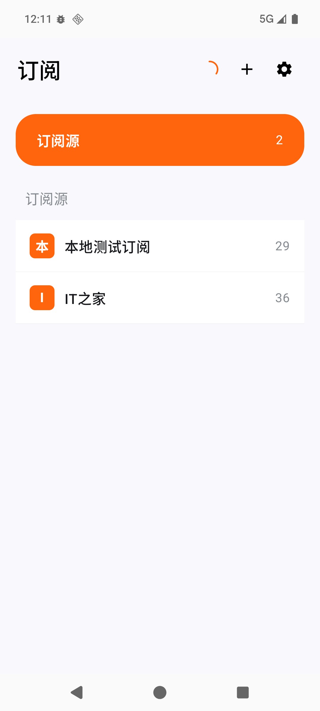

# RSS 阅读器 Android

[](https://github.com/dypublic/rss_reader_android/actions/workflows/android-build.yml)

这是按已确认需求实现的个人 RSS 阅读器。界面只用浅色，数据保存在本机；订阅源只接受 RSS 2.0 和 Atom。列表只按单个订阅源查看，默认未读，时间最旧优先。文章打开或由用户向下划过屏幕顶部时标为已读；已读文章 30 天后清理，未读文章一直保留。

## 界面

| 订阅页 | 文章列表 | 阅读页 |
|---|---|---|
|  |  |  |

## 使用

在 Android 8.0 或更高版本设备上运行。打开后点右上角 `＋`，粘贴订阅地址，先验证来源名称，再确认添加。可用的真实样例是 [IT之家 RSS](https://www.ithome.com/rss/)。长按订阅源可重命名或删除。

订阅页右上角进入设置可调整全局阅读字号。文章页右上角可再次调字号，点击图片可放大，原文按钮交给系统浏览器。

## 构建

需要 JDK 17、Android SDK API 37（`platforms;android-37.0`）、Build Tools 36.0.0，以及可访问 Google Maven、Maven Central 和 Gradle 官方下载站的网络。项目自带 Gradle 9.6.0 Wrapper；在本目录运行：

```sh
./gradlew :app:testDebugUnitTest :app:assembleDebug
```

APK 输出在 `app/build/outputs/apk/debug/app-debug.apk`。可用 `adb install -r app/build/outputs/apk/debug/app-debug.apk` 安装到模拟器或设备。

## GitHub 自动构建

推送到 `main` 后，GitHub Actions 会自动运行单元测试并生成可安装的 debug APK。也可以在仓库的 **Actions → Build Android APK → Run workflow** 手动触发。

构建完成后打开对应的 workflow run，在页面底部 **Artifacts** 下载 `rss-reader-debug-构建编号`。压缩包内包含：

- `rss-reader-v0.1-debug.apk`：可安装 APK。
- `SHA256SUMS.txt`：APK 完整性校验值。

构建产物保留 30 天。debug APK 使用 Android 默认调试密钥，不能覆盖安装正式版本；长期使用应从 Releases 下载由固定密钥签名的 release APK。

### 签名 release APK

仓库配置好 `ANDROID_KEYSTORE_BASE64`、`ANDROID_KEYSTORE_PASSWORD`、`ANDROID_KEY_ALIAS` 和 `ANDROID_KEY_PASSWORD` 四个 Actions Secrets 后，可在 **Actions → Build Signed Release APK → Run workflow** 输入版本号并手动构建；这种方式只上传临时 Artifact。

推送 `v*` 标签会触发正式发布：标签 `v0.2.0` 会构建 `rss-reader-0.2.0-release.apk`，创建对应的 GitHub Release，并附上 APK、SHA-256 和签名证书信息。重复运行同一标签时会替换 Release 附件，不会创建重复版本。

Release workflow 使用固定 keystore 签名，并自动使用 workflow 的递增运行编号作为 `versionCode`。产物同时包含 APK 的 SHA-256 文件和签名证书信息。JKS、Base64 副本及本地签名配置均由 `.gitignore` 排除。

## 源码结构

- `app/src/main/java/com/codex/rssreader/ui/`：订阅页、单来源文章列表、阅读页、设置页和浅色样式。
- `app/src/main/java/com/codex/rssreader/data/`：RSS/Atom 获取解析、Room 本地数据库、DataStore 字号设置和刷新仓库。
- `app/src/main/java/com/codex/rssreader/rules/`：首次最新 20 篇和快速滑过的已读范围规则。
- `app/src/main/java/com/codex/rssreader/AppViewModel.kt`：刷新和列表状态。

进一步资料：

- [产品需求](docs/产品需求.md)
- [模块与开发规划](docs/模块与开发规划.md)
- [验收用例](docs/验收用例.md)
- [完整本地开发环境搭建](docs/本地开发环境搭建.md)
- [开发验证](docs/开发验证.md)
- [Android 模拟器使用说明](docs/Android模拟器使用说明.md)
- [发布与签名](docs/发布与签名.md)
- [故障排查](docs/故障排查.md)

## 试用范围

APK 已在本地 Android 16 ARM64 模拟器安装和运行；尚未在真实手机上验收。文章文字和已读状态可本地保存，正文图片按需联网加载。当前未提供账号、收藏、分组、跨来源全部文章页、后台定时刷新、深色主题或网页全文抓取。
